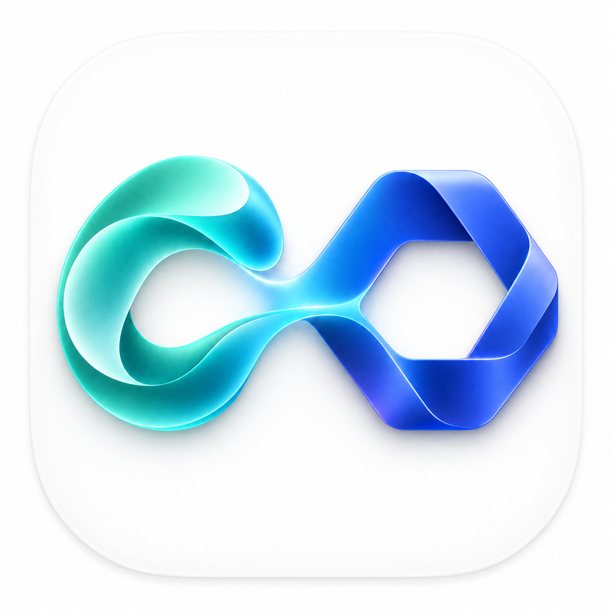
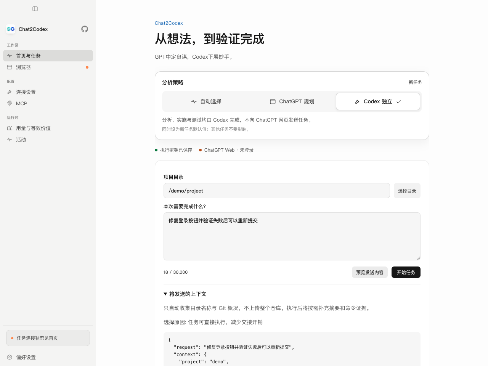
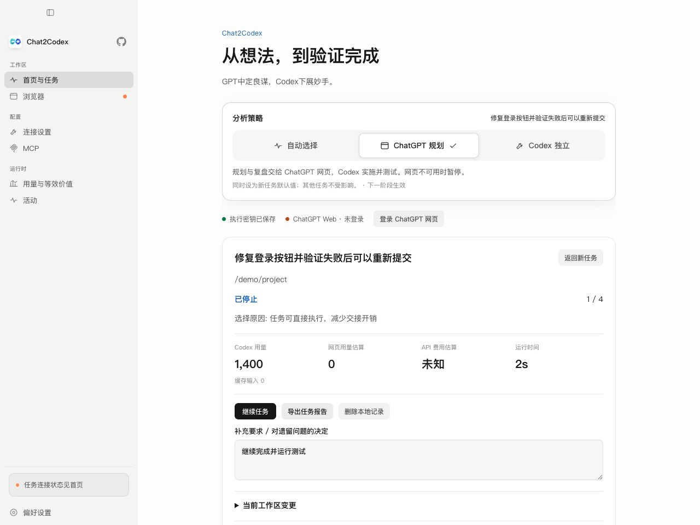
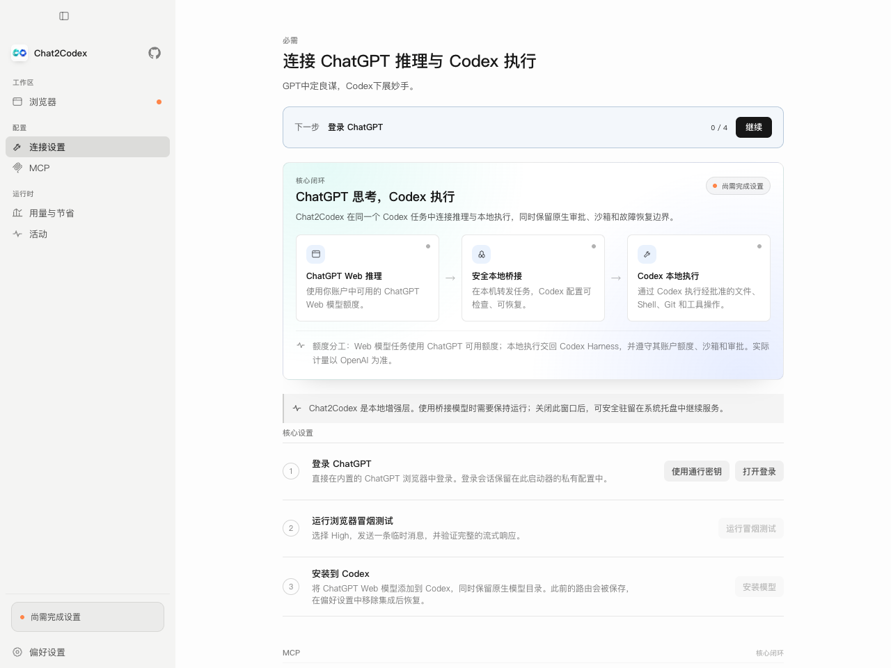

<div align="center">
  
  <h1>Chat2Codex</h1>
  <p><strong>GPT中定良谋，Codex下展妙手。</strong></p>
  <p>让 ChatGPT Web 负责推理与决策，让 Codex 继续负责本地文件、Shell、Git 和工具执行。</p>
  <p>
    <a href="README.md">简体中文</a> ·
    <a href="README.en.md">English</a>
  </p>
  <p>
    <a href="https://github.com/pangao1990/Chat2Codex/releases/latest">下载程序包</a> ·
    <a href="docs/INSTALLATION.md">完整安装教程</a> ·
    <a href="docs/DEVELOPMENT.md">二次开发教程</a> ·
    <a href="TROUBLESHOOTING.md">故障排查</a>
  </p>
  <p>
    <a href="https://github.com/pangao1990/Chat2Codex/actions/workflows/ci.yml"></a>
    <a href="LICENSE"></a>
    
    
    
  </p>
</div>

> [!IMPORTANT]
> Chat2Codex 当前版本为 **V1.0.0 正式版**。首页提供自动选择、ChatGPT 规划和 Codex 独立三种策略。
> 网页规划依赖 ChatGPT 界面兼容性；平台与真实账号的验证范围见[当前实现状态](docs/chat2codex-status.md)。

## 首页任务工作台

**选择策略 → 输入需求 → 规划（可选）→ Codex 修改与测试 → 复盘和验收。**

首页提供醒目的 **自动选择 / ChatGPT 规划 / Codex 独立** 三段选择器，运行中切换在下一阶段生效。

| 功能 | 行为 |
| --- | --- |
| 自动选择 | 本地规则评估规划收益、上下文交接开销与停滞情况，不承诺节省比例 |
| 手动锁定 | ChatGPT 规划失效时暂停；Codex 独立不要求网页登录 |
| API 执行器 | 通过本地 Codex App Server 使用 OpenAI 官方 API，隔离配置与密钥 |
| 任务控制 | 队列、阶段暂停、停止、显式恢复、权限请求、人工验收 |
| 上下文与记录 | 发送前预览、方案和命令证据、搜索筛选、导出及删除 |
| 用量与预算 | Codex 用量、网页估算、可选价格、轮数/Token/时间限制 |

新工作台需要 **Codex CLI 与执行 API Key**；只有选择网页规划时才需要 ChatGPT 登录。它不需要旧桥接的模型安装或 MCP Tunnel。先阅读 [工作台使用指南](docs/workbench.md)。

首次使用首页工作台：

1. 安装 Codex CLI，在“连接与执行设置”中保存 OpenAI 执行 API Key 和可用模型。
2. 点击“检查执行连接（不调用模型）”，确认本地协议和 API 模型访问正常。
3. 选择策略；使用 ChatGPT 规划时，在程序浏览器内登录 ChatGPT。
4. 选择项目、填写目标与验收条件，预览发送内容，再开始任务。
5. 在任务详情核对修改、命令与测试结果；遇到权限请求或待验收状态时按提示处理。

Codex 执行使用单独计费的 API。自动选择基于规则，是否节省应比较相同任务和验收质量下的实际消耗。

原有“在 Codex 中使用 ChatGPT Web 模型”的桥接路径继续保留，仍按登录、浏览器测试、模型路由、MCP 的流程设置。下方详细安装与桥接说明主要针对这条旧路径。

### 页面预览

以下是实际渲染器使用模拟数据的截图，不代表真实账户用量或已验证的节省。



<details>
<summary>任务详情与旧桥接设置</summary>




</details>

## 先选择你的使用方式

这个项目面向两种用户。请直接进入与你相符的部分：

| 你是谁 | 应该怎么开始 |
| --- | --- |
| **普通用户：只想安装软件使用** | 阅读[第一部分：直接安装程序包](#package-users)。你不需要安装 Bun、Node.js、npm 或源码依赖。 |
| **开发者：想修改源码或做二次开发** | 先了解普通用户流程，再阅读[第二部分：二次开发](#developers)。全部开发工具和依赖都可以安装在项目目录中。 |

README 的主要内容为普通用户编写。技术细节和贡献流程放在后半部分，不影响安装软件。

## 目录

- [第一部分：直接安装程序包的用户](#package-users)
  - [这个软件是什么](#what-is-it)
  - [是否适合你](#should-i-use-it)
  - [下载与安装](#install-package)
  - [第一次配置](#first-run)
  - [日常使用](#daily-use)
  - [更新与卸载](#update-and-uninstall)
  - [用量、费用与隐私](#usage-and-privacy)
  - [普通用户排错](#user-troubleshooting)
  - [常见问题](#faq)
- [第二部分：二次开发](#developers)
- [第三部分：技术说明](#technical-reference)
- [文档、贡献与许可](#project-docs)

<a id="package-users"></a>
# 第一部分：直接安装程序包的用户

如果你只想使用 Chat2Codex，这一部分就是完整的入门教程。请直接下载与你电脑相符的程序包，
不需要克隆源码，也不需要配置开发环境。

<a id="what-is-it"></a>
## 1. 这个软件是什么？

Chat2Codex 是一个需要与官方 Codex Desktop 或 Codex CLI 配合使用的独立桌面程序。

它由两部分组成：

1. 一个可视化启动器，用来登录 ChatGPT、完成连接设置、查看状态和用量。
2. 一个只在本机运行的桥接服务，把 Codex 任务交给 ChatGPT Web 思考，再把本地操作交回 Codex。

它不是：

- ChatGPT 或 Codex 的替代品；
- 浏览器扩展或网页；
- 需要部署到服务器的云服务；
- 用来绕过账户额度、限流、安全策略或权限的工具。

### 一分钟问答

| 问题 | 回答 |
| --- | --- |
| 能解决什么问题？ | 在 Codex 工作流中使用 ChatGPT Web 的可用额度思考，同时保留 Codex 的文件、Shell、Git 和工具能力。 |
| 要单独购买推理 API 吗？ | 新任务工作台需要执行 API Key，按 API 用量付费；旧 Web 桥接无需单独的推理 API Key。旧 Full 模式的 Tunnel Key 不用于模型推理。 |
| 是独立程序吗？ | 是。它是 Electron 桌面程序，安装后与 Codex 配合运行。 |
| 需要一直打开吗？ | 使用 `ChatGPT Web` 桥接模型时，后台服务必须运行。主窗口可以关闭，Chat2Codex 会驻留系统托盘。 |
| 默认是什么界面？ | 默认简体中文和浅色主题，可以切换为英文和深色主题；不提供日语界面。 |
| 会读取官方应用的 Cookie 吗？ | 不会。它使用自己的隔离浏览器配置，需要单独登录一次 ChatGPT。 |

<a id="should-i-use-it"></a>
## 2. 我是否需要 Chat2Codex？

官方 ChatGPT 桌面版已经整合 ChatGPT、Codex、本地项目和插件。请根据实际目标选择：

| 你的目标 | 推荐方案 |
| --- | --- |
| 在官方工作区中使用普通 ChatGPT 和 Codex | 直接使用[官方 ChatGPT 桌面版](https://learn.chatgpt.com/docs/app) |
| 在 Codex 模型列表中选择 ChatGPT Web 推理模型，并保留 Codex 本地操作能力 | 使用 Chat2Codex |
| 只想在网页中聊天，不需要文件、Shell、Git 或工具 | 直接使用 ChatGPT 网页版 |
| 想复用其他应用的 Cookie、登录状态或私有数据 | 不支持；Chat2Codex 刻意隔离这些数据 |
| 想绕过订阅额度、限流、安全策略或访问控制 | 不支持，也不是本项目目标 |

<a id="install-package"></a>
## 3. 下载与安装程序包

### 3.1 使用前准备

你需要：

- 已安装官方 Codex Desktop 或 Codex CLI；
- 一个可以正常使用 ChatGPT 网页版的账户；
- 能访问 ChatGPT 和 GitHub Releases 的网络；
- 如果要使用完整本地工具闭环，账户还需要能够创建 MCP Tunnel 和 ChatGPT Connector。

### 3.2 选择正确的文件

打开 [GitHub Releases](https://github.com/pangao1990/Chat2Codex/releases/latest)，进入最新版本，按电脑选择：

| 电脑 | 下载文件 | 如何判断 |
| --- | --- | --- |
| Apple 芯片 Mac | `chat2codex-<版本>-mac-arm64.dmg` | “关于本机”显示 M1、M2、M3、M4、M5 等 |
| Intel Mac | `chat2codex-<版本>-mac-x64.dmg` | “关于本机”显示 Intel |
| Windows 10/11 64 位 | `chat2codex-<版本>-win-x64.exe` | 绝大多数现代 Windows 电脑 |
| Linux 64 位 Intel/AMD | `chat2codex-<版本>-linux-x64.AppImage` | `uname -m` 显示 `x86_64` |

不要给普通用户下载源码 ZIP。源码 ZIP 是给开发者使用的，不能代替已经构建好的 DMG、EXE 或 AppImage。

每个 Release 还会提供 `checksums.txt` 和安装脚本。需要校验 SHA-256 或使用一键安装脚本时，请阅读
[中文安装教程](docs/INSTALLATION.md)；英文版是 [docs/INSTALLATION.en.md](docs/INSTALLATION.en.md)。

### 3.3 macOS 安装

1. 双击下载的 DMG。
2. 将 Chat2Codex 拖入“应用程序”。
3. 从“应用程序”打开 Chat2Codex。
4. 如果系统提示无法验证开发者，先确认文件来自本仓库 Release，并核对 SHA-256。不要关闭 macOS
   整体安全保护；程序包是否已签名或公证以 Release 说明为准。

支持 macOS 13 或更高版本，并分别提供 Apple 芯片和 Intel 安装包。

### 3.4 Windows 安装

1. 双击 `chat2codex-<版本>-win-x64.exe`。
2. 按向导完成当前用户安装，不需要管理员权限。
3. 从开始菜单或桌面快捷方式打开 Chat2Codex。
4. 如果安全软件拦截程序包，请先核对 Release 来源和 SHA-256，不要直接关闭安全软件。

目前提供 Windows 10/11 x64 安装包。

### 3.5 Linux 安装

推荐按照[中文安装教程](docs/INSTALLATION.md)运行 Release 中的安装脚本。它会把程序安装到当前用户目录，
不需要 `sudo`，并创建命令和桌面菜单。

也可以直接给 AppImage 添加执行权限后运行。当前成品只提供 Linux x64；开发环境支持范围不等于已经
发布了相应架构的安装包。

### 3.6 程序包会不会安装 Bun、Node.js？

不会在电脑中添加全局 `bun`、`node` 或 `npm` 命令。成品程序已经内置运行时和 JavaScript 依赖，
普通用户不需要了解或安装这些开发工具。

<a id="first-run"></a>
## 4. 第一次配置

Chat2Codex 会自动打开下一个未完成步骤。按照界面从上到下操作即可：

### 第一步：登录 ChatGPT

点击“打开登录”，在 Chat2Codex 自己的浏览器窗口中登录。这个登录空间与 Chrome、Safari、官方
ChatGPT 桌面版和 Codex 相互隔离，因此即使其他地方已经登录，这里仍可能需要登录一次。

不要把 Cookie、验证码、API Key 或浏览器配置发送给任何人，也不要上传到 GitHub Issue。

### 第二步：运行浏览器测试

登录成功后运行浏览器冒烟测试。它会验证当前账户、Temporary Chat、推理模式和网页控件是否可用。
测试失败时先查看完整错误，不要连续重复点击。

### 第三步：安装 ChatGPT Web 模型

如果没有其他 Codex 路由管理器，选择 Standalone。Chat2Codex 只管理自己登记的路由字段，并保存恢复记录。

如果正在使用 CC Switch 等管理 `openai_base_url` 的工具，选择 External Manager。此模式不会写入
`~/.codex/config.toml`，需要由外部管理器导入 Chat2Codex 路由。一个 Codex 环境只能有一个路由写入者。

### 第四步：完全重启 Codex

安装模型后，必须完全退出所有 Codex Desktop 窗口和 Codex CLI 进程，再重新打开。退出账号、只关闭
窗口或新建任务都不会刷新模型目录。

### 第五步：选择 Browser-only 或完整 MCP

| 模式 | 能做什么 | 是否需要 Tunnel 和 Connector |
| --- | --- | --- |
| Browser-only | ChatGPT Web 可以思考并回答，但不能调用本地 Codex 工具 | 否 |
| Full / MCP 核心闭环 | ChatGPT Web 思考，Codex 执行文件、Shell、Git 和工具操作 | 是 |

本项目的主要目标是完整闭环。如果需要本地操作，请继续完成启动器中的 **MCP 核心闭环**：

1. 按向导创建或填写 Tunnel。
2. 使用向导提供的一键复制功能，创建名称完全一致的 ChatGPT Connector。
3. 按界面要求配置 Connector 权限。
4. 连接 Harness，然后运行验证。

MCP 使用的普通 API Key 用于建立 Tunnel，不用于购买 ChatGPT Web 推理额度。凭据保存在 Chat2Codex
的私有本地存储中，不会写入普通日志。

### 第六步：在 Codex 中开始任务

1. 打开 Codex。
2. 在模型选择器中选择带 `ChatGPT Web` 标识的模型。
3. 像平时一样输入任务。
4. 文件修改、终端命令、Git 操作和审批仍会显示在 Codex 中。

<a id="daily-use"></a>
## 5. 日常使用

### 每次开始

1. 启动 Chat2Codex。
2. 确认系统托盘显示“思考与执行闭环已就绪”。
3. 打开 Codex，选择需要的 `ChatGPT Web` 模型。
4. 正常描述任务，无需复制粘贴 ChatGPT 和 Codex 之间的内容。

### 软件需要一直打开吗？

使用 `ChatGPT Web` 模型时需要后台服务运行，但不要求主窗口一直显示：

- 可以关闭主窗口，Chat2Codex 会继续驻留系统托盘；
- 托盘可以快速打开浏览器、连接设置、用量与节省和偏好设置；
- 不要在任务进行中从托盘选择“退出”；
- 如果程序完全退出，本地桥接地址会失效，正在运行的 Web 回合可能中断；
- 只使用 Native Codex 模型时，不依赖 Chat2Codex 后台服务。

### 任务完成通知

当 Chat2Codex 不在前台时，普通 Web 推理任务完成后会显示系统通知。通知不包含任务名、提示词、回答
或文件名，内部上下文压缩也不会重复通知。可以在“偏好设置”中关闭。

### ChatGPT Web 不可用时

Chat2Codex 不会在同一个回答中偷偷更换模型。只有额度、限流、模型不可用、浏览器异常或登录失效等
可用性问题，才允许后续重试或续接在完整回合边界切换到 Native Codex。安全拒绝、用户取消、权限或
Sandbox 拒绝不会触发回退。

<a id="update-and-uninstall"></a>
## 6. 更新、修复与卸载

### 更新

- 程序内出现更新提示时，可以按提示安装；
- 也可以退出 Chat2Codex 后，从 GitHub Releases 下载新版并覆盖安装；
- 正常更新会保留 Chat2Codex 设置和独立浏览器登录空间；
- 升级前建议先查看 Release Notes 和[实现状态](docs/chat2codex-status.md)。

### 修复 Codex 集成

如果模型消失或路由异常，先运行“偏好设置 → 运行诊断”，再使用“修复 Codex 设置”一次并完全重启
Codex。不要反复安装，也不要先手工删除配置；恢复记录用于保护安装前的路由。

### 正确卸载

1. 在 Chat2Codex 中选择“移除 Codex 集成”，等待旧路由恢复。
2. 完全重启 Codex，确认不再使用 Chat2Codex 路由。
3. 退出托盘中的 Chat2Codex。
4. macOS 从“应用程序”删除；Windows 从“已安装的应用”卸载；Linux 按安装教程移除用户目录文件。
5. 如果不再需要登录和设置，可以在程序完全退出后删除 `~/.chat2codex/`。此目录可能包含敏感登录材料，
   不要复制或分享。

先删除程序、后移除集成，可能让 Codex 暂时指向一个已经不存在的本地服务，因此顺序不能颠倒。

<a id="usage-and-privacy"></a>
## 7. 用量、费用与隐私

### 是否需要付费？

Chat2Codex 是 MIT 开源软件，不收取软件费用。新工作台的 Codex 执行按 API 用量计费；旧 Web 桥接无需单独购买推理 API。你仍需要自行拥有可用的
ChatGPT/Codex 账户、套餐能力和网络条件。Chat2Codex 不会增加、修改或绕过官方额度。

### 会消耗哪一边的额度？

- ChatGPT Web 负责的推理会占用 ChatGPT 套餐额度；
- Codex 外层执行、审批或可选原生能力仍可能使用 Codex 额度；
- 文件读写和 Shell 命令本身不是模型 Token，但驱动工具的模型回合可能被计量；
- 实际计量、模型可用性和冷却时间以官方账户显示为准。

### “API 等效价值”是什么意思？

“用量与等效价值”是本地粗略估算，不是官方账单：

- 根据桥接回合中的文本和图片上下文估算输入、输出 Token；
- 使用匹配后端模型的 OpenAI Standard 短上下文 API 公开价格换算；
- 软件会显示价格日期和[官方定价来源](https://developers.openai.com/api/docs/pricing)；
- API 等效价值不是实际节省、现金、退款、余额或抵扣；
- Chat2Codex 无法读取官方精确余额、剩余额度或重置时间，也不会伪造这些数据。

### 保存哪些数据？

| 数据 | 位置与说明 |
| --- | --- |
| 正式版设置、私有运行时和登录空间 | `~/.chat2codex/` |
| 开发版数据 | `~/.chat2codex-dev/`，不会与正式版复用 |
| 旧桥接用量记录 | 只保存聚合 Token、回合和估算金额，不保存提示词、回答、任务名或文件内容 |
| 工作台任务历史 | `workbench/` 下保存需求、计划、命令证据及独立执行历史，支持按任务删除；执行 Key 单独加密保存 |
| Codex 路由恢复信息 | 只记录 Chat2Codex 管理的字段，用于安全恢复 |

本地 Responses 服务只绑定 `127.0.0.1`，不会直接暴露给局域网。Chat2Codex 不读取或复制官方
ChatGPT/Codex 应用的 Cookie、历史记录和私有配置。诊断导出会过滤凭据和常见本地隐私信息，但分享前
仍应自行检查。

启用 Full 模式前请阅读 [SECURITY.md](SECURITY.md) 和[安全模型](docs/security-model.md)。

<a id="user-troubleshooting"></a>
## 8. 普通用户排错

遇到问题时按这个顺序检查：

1. 确认安装的是最新 Release，并让 Chat2Codex 保持运行。
2. 查看登录、浏览器测试、安装模型、Codex 重启和 MCP 验证是否全部完成。
3. 完全退出并重新打开 Codex，然后重新选择带 `ChatGPT Web` 标识的模型。
4. 打开“偏好设置 → 运行诊断”，阅读每一项失败原因。
5. 只复现一次问题，然后到“活动 → 导出隐私安全日志”。
6. 阅读[完整故障排查](TROUBLESHOOTING.md)。仍无法解决时提交
   [GitHub Issue](https://github.com/pangao1990/Chat2Codex/issues)。

启动读取失败时可点击“重试 / Retry”。用量读取失败不会显示成零；刷新失败时显示上次有效数据及其更新时间。
若清零失败，请先恢复已配置的本地服务再重试，程序不会假报清零成功。“活动”支持搜索完整详情和筛选错误，
点击事件可展开详情；诊断报告中可展开“查看详情与恢复建议”。

Issue 中应包含操作系统与架构、Chat2Codex/Codex 版本、所选模型、Browser-only 或 Full 模式、最小
复现步骤、完整最终错误和隐私安全日志。不要上传 Cookie、API Key、Tunnel ID、浏览器存储或未经处理的
私有提示词。

<a id="faq"></a>
## 9. 普通用户常见问题

### 官方 Codex 已经内置 ChatGPT，为什么还需要本项目？

官方桌面版适合普通的官方 ChatGPT 与 Codex 工作流。Chat2Codex 解决更具体的需求：让 ChatGPT Web
推理模型出现在 Codex 模型路由中，并继续使用 Codex 原生工具闭环。如果不需要这种路由，官方应用通常
更简单。

### 为什么不能复用其他应用中已经登录的 ChatGPT？

复制 Cookie 或浏览器状态会增加凭据泄露和账户混用风险。Chat2Codex 要求在独立 Profile 中单独登录
一次，以获得清晰的数据所有权和删除边界。

### 为什么设置后 Codex 里没有新模型？

Codex 会缓存模型目录。必须完全退出所有 Codex Desktop 和 CLI 进程后重新打开。只关闭一个窗口、退出
账号或新建任务都不够。

### 可以同时使用 CC Switch 吗？

可以，但不能让两个程序同时写同一个 Codex 路由。让 CC Switch 管理路由时，应选择 External Manager，
由它导入 Chat2Codex 提供的地址；不要让 Chat2Codex Standalone 与另一个路由写入者同时工作。

### 可以并发运行很多任务吗？

程序的五个浏览器任务标签只是安全上限，不是推荐并发数。ChatGPT 账户可能在更低并发下触发限流。
初次使用建议一次运行一个任务，确认稳定后再谨慎增加。

### 支持图片和图片生成吗？

普通图片上下文受所选模型与 ChatGPT 网页能力限制。图片生成使用不同的生成和下载流程，目前不是支持的
回合类型。

<a id="developers"></a>
# 第二部分：做二次开发的开发者

开发者应先理解上面的普通用户流程，因为界面、安装包和故障信息都围绕这条流程设计。下面只介绍源码
环境；更完整的解释见[中文二次开发教程](docs/DEVELOPMENT.md)和
[English guide](docs/DEVELOPMENT.en.md)。

## 1. 获取源码并一键安装项目内环境

```bash
git clone https://github.com/pangao1990/Chat2Codex.git
cd Chat2Codex
./scripts/setup-local.sh
```

```powershell
git clone https://github.com/pangao1990/Chat2Codex.git
Set-Location Chat2Codex
scripts\setup-local.cmd
```

脚本会校验下载内容，并将锁定版本的 Bun 1.4.0、Node.js 24.14.0、Electron、依赖和持久缓存放在当前
仓库中，不修改 Shell Profile、系统环境变量或全局包目录。

| 内容 | 项目内位置 |
| --- | --- |
| Bun 与 Node.js | `.tools/` |
| Bun、npm、Node.js 和 Electron 缓存 | `.cache/` |
| 核心依赖 | `node_modules/` |
| 桌面启动器依赖 | `launcher/node_modules/` |

## 2. 国内源和官方源

默认 `auto` 会测速并记住所选线路，也可以手动指定：

```bash
CHAT2CODEX_SOURCE=china ./scripts/setup-local.sh
CHAT2CODEX_SOURCE=official ./scripts/setup-local.sh
```

```powershell
$env:CHAT2CODEX_SOURCE = "china"
scripts\setup-local.cmd
```

国内镜像用于下载二进制和依赖，校验值仍来自官方发布源。安全审计会临时访问 npm 官方公告接口，因为
npmmirror 不提供该接口；不会修改电脑的 npm 配置。

## 3. 启动开发版

```bash
./scripts/bun-local.sh run app
```

```powershell
scripts\bun-local.cmd run app
```

开发版使用 `~/.chat2codex-dev/`，与正式版浏览器、登录、运行时和 Codex 配置隔离。

## 4. 测试和构建

```bash
./scripts/bun-local.sh run verify
./scripts/bun-local.sh test tests/*.test.ts
./scripts/bun-local.sh run launcher:test
./scripts/bun-local.sh run app:package
```

```powershell
scripts\bun-local.cmd run verify
scripts\bun-local.cmd test tests/*.test.ts
scripts\bun-local.cmd run launcher:test
scripts\bun-local.cmd run app:package
```

安装包输出到 `launcher/artifacts/`。由于内置平台相关的 Bun 和 Electron 运行时，macOS、Windows、Linux
必须分别在对应系统构建，不能从一个平台交叉生成所有成品。

## 5. 项目结构

另外可运行 `./scripts/bun-local.sh run launcher:smoke:ui`（Windows 使用
`scripts\bun-local.cmd run launcher:smoke:ui`）执行真实 Chromium 界面回归。需要已安装 Google Chrome，
或用 `CHAT2CODEX_TEST_BROWSER` 指定 Chromium 可执行文件。测试只注入模拟 IPC，不登录账户、不修改
Codex 配置，截图写入 `output/playwright/`。详细覆盖范围见[界面验证](docs/ui-validation.md)。

`verify` 检查版本、依赖审计、类型、单元/集成测试、构建和可迁移运行时。它与界面回归都不能替代
真实账户和各系统安装包验收。发布前请完成[发布验证](docs/release-validation.md)。

| 路径 | 作用 |
| --- | --- |
| `src/` | CLI、Responses 服务、路由、ChatGPT Web Adapter、Codex 集成和用量记录 |
| `launcher/src/` | React 桌面界面、国际化和样式 |
| `launcher/electron/` | Electron 主进程、隔离浏览器、托盘、更新和运行时管理 |
| `tests/`、`launcher/tests/` | 核心和桌面启动器自动化测试 |
| `scripts/` | 本地工具链、构建、检查和发布脚本 |
| `docs/` | 安装、开发、架构、安全和发布文档 |

<a id="technical-reference"></a>
# 第三部分：技术说明

## 工作原理

首页工作台：需求 → 可选的 ChatGPT 网页方案 → Codex API 执行与测试 → 摘要复盘 → 继续或验收。每阶段都保留用量、状态与证据，切换策略在阶段边界生效。

原有 Web 模型桥接路径：

```text
在 Codex 中选择 ChatGPT Web 模型
                 ↓
ChatGPT Web 使用账户可用额度进行推理和决策
                 ↓
Chat2Codex 通过本机回环服务传递请求
                 ↓
Codex Harness 执行经批准的文件、Shell、Git 和工具操作
                 ↓
工具结果返回同一个推理回合，直至任务完成
```

## 核心安全机制

- ChatGPT-first 路由与按模型隔离的 Circuit Breaker；
- Quality Lock：未经用户明确允许，不静默降低推理档位；
- 只在完整回合边界回退 Native Codex；
- Tool ledger 降低续接时重复执行已完成副作用的风险；
- Standalone 只管理已登记路由字段，并保留私有恢复记录；
- External Manager 对 `~/.codex/config.toml` 保持只读；
- Full 模式仍受 Codex Sandbox、审批和 Connector 权限约束；
- 健康检查、隐私安全日志、自动更新和受控运行时恢复。

更详细的数据流、组件职责和信任边界见[架构文档](docs/architecture.md)和
[安全模型](docs/security-model.md)。

## 已知限制

- ChatGPT 网页 DOM 或交互流程更新后，可能需要发布兼容性修复；
- 真实账户、额度错误、CC Switch 共存和跨平台新装的验证范围，以本次验收记录为准；
- 无法显示官方精确余额、剩余额度和重置时间；
- 图片生成不是当前支持的回合类型；
- Linux 成品目前只提供 x64 AppImage；
- 自行构建的未签名或未公证程序包可能触发操作系统安全提示。

以[实现状态](docs/chat2codex-status.md)和[发布验证清单](docs/release-validation.md)为准；版本号不代表已获得 OpenAI 官方认证，也不代表所有环境均经过验收。

项目基于 [miuuyy/codex-chatgpt-web](https://github.com/miuuyy/codex-chatgpt-web) 4.0.8。
准确的上游提交、同步方式和版权说明见 [UPSTREAM.md](UPSTREAM.md)。

<a id="project-docs"></a>
# 文档、贡献与许可

## 文档索引

| 文档 | 内容 |
| --- | --- |
| [普通用户安装教程](docs/INSTALLATION.md) / [English](docs/INSTALLATION.en.md) | 下载、校验、安装、首次启动、更新和卸载 |
| [二次开发教程](docs/DEVELOPMENT.md) / [English](docs/DEVELOPMENT.en.md) | 项目内工具链、依赖更新、测试、打包和清理 |
| [故障排查](TROUBLESHOOTING.md) | 登录、模型目录、MCP、路由冲突和浏览器错误 |
| [实现状态](docs/chat2codex-status.md) | 已实现功能和仍需真实环境验证的内容 |
| [架构](docs/architecture.md) | 组件职责、请求链路和数据流 |
| [安全模型](docs/security-model.md) | 信任边界、工具调用和失败关闭原则 |
| [DEV Chat](docs/dev-chat.md) | 隔离浏览器和模拟 MCP 开发流程 |
| [发布验证](docs/release-validation.md) | 发布前的自动检查和真实账户验收 |
| [本次上线前检查](docs/pre-release-check.md) | 已通过的测试、安装包结果与待完成的真实环境验收 |
| [贡献指南](CONTRIBUTING.md) | Issue、代码、测试和 Pull Request 要求 |

## 参与贡献

欢迎提交聚焦、可验证的 Bug 修复、回归测试、文档改进和平台兼容性修复。开始前请阅读
[CONTRIBUTING.md](CONTRIBUTING.md)：

1. 先搜索现有 Issue；
2. 大功能、架构调整、新 Provider 或大范围重构应先讨论；
3. 行为修改必须增加测试并运行完整验证；
4. 浏览器兼容修改必须基于真实 DOM 证据；
5. 不得提交 Cookie、浏览器状态、密钥、Tunnel ID、日志、Codex 历史或本机绝对路径。

普通问题请提交 [GitHub Issue](https://github.com/pangao1990/Chat2Codex/issues)。安全漏洞请按照
[SECURITY.md](SECURITY.md) 私密报告，不要公开漏洞细节或凭据。

## 开源许可

Chat2Codex 使用 [MIT License](LICENSE)。项目保留上游版权和第三方许可声明；派生、分发和二次开发时
请继续遵守这些声明。
